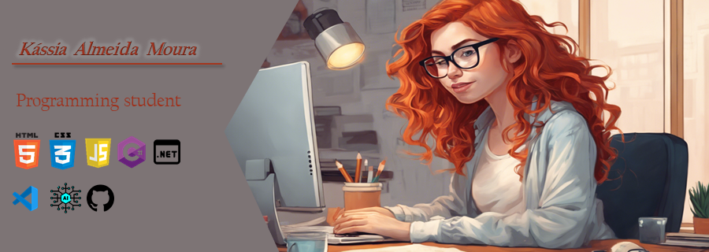
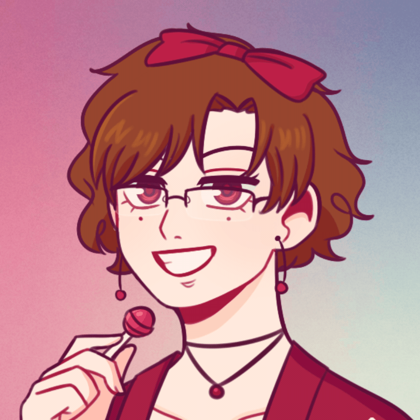

  

<h3 align="center">
  Programming student
</h3>

  
  
   
  

 
 
 

    
    
    

 
 

## Technologies

 
 
 
 

## About me

-  Hello! My name is Kássia Almeida Moura and I have a degree in Administration and I am studying Programming at Rocketseat and DIO.

-  My current goal is to get my first job as a programmer. 

-  I am an organized, proactive, persistent person, I like interacting with other people and working in a team, and I am very dedicated to work and studies. 

## Some courses.....
-  Studying programming at [Rocketset](https://www.rocketseat.com.br)  

-  I took the Santander Bootcamp 2024 - AI Fundamentals for Devs at [DIO](https://web.dio.me/)  

- I took the Bootcamp Coding The Future Avanade - .NET Developer DIO at [DIO](https://web.dio.me/)  

- I am a DIO Campus Expert Ambassador 2024 at [DIO](https://web.dio.me/)  

<picture>
  <source media="(prefers-color-scheme: dark)" srcset="https://raw.githubusercontent.com/YourUser/Kassia08/output/github-contribution-grid-snake-dark.svg">
  <source media="(prefers-color-scheme: light)" srcset="https://raw.githubusercontent.com/Kassia08/Kassia08/output/github-contribution-grid-snake.svg">
  
</picture>
